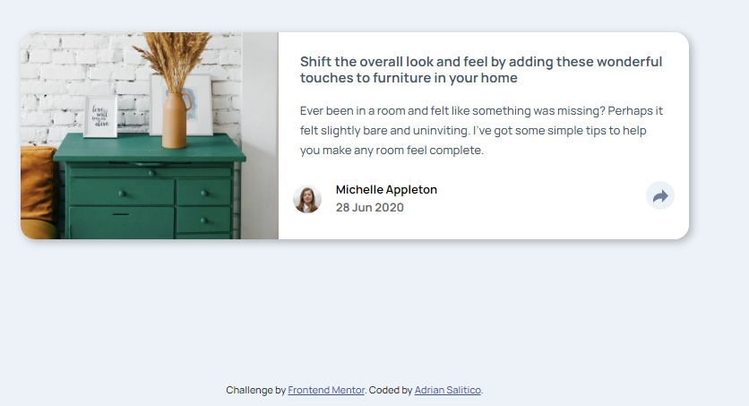
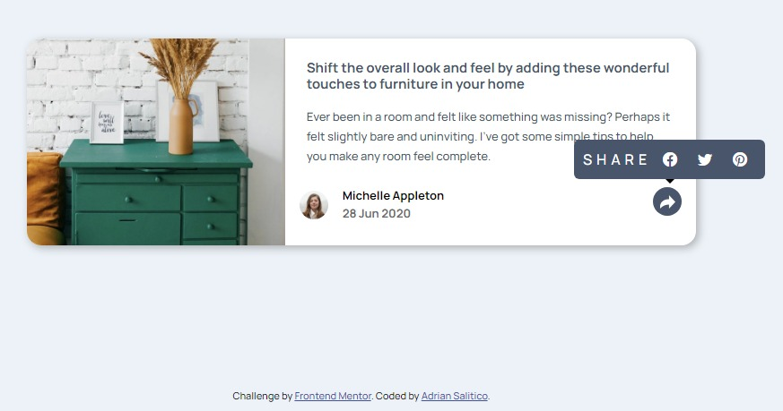
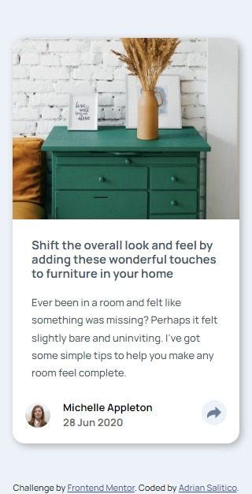
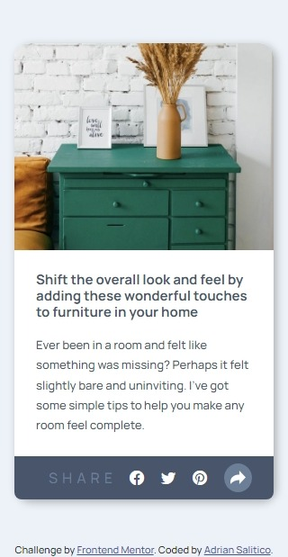

# Frontend Mentor - Article preview component solution

This is a solution to the [Article preview component challenge on Frontend Mentor](https://www.frontendmentor.io/challenges/article-preview-component-dYBN_pYFT). Frontend Mentor challenges help you improve your coding skills by building realistic projects.

## Table of contents

- [Overview](#overview)
  - [The challenge](#the-challenge)
  - [Screenshot](#screenshot)
  - [Links](#links)
- [My process](#my-process)
  - [Built with](#built-with)
  - [What I learned](#what-i-learned)
  - [Continued development](#continued-development)
  - [Useful resources](#useful-resources)
- [Author](#author)
- [Acknowledgments](#acknowledgments)

## Overview

### The challenge

Users should be able to:

- View the optimal layout for the component depending on their device's screen size
- See the social media share links when they click the share icon

### Screenshot

#### Desktop Default & Active




#### Mobile Default & Active




### Links

- Solution URL: [https://github.com/Frogerall/article-card](https://github.com/Frogerall/article-card)
- Live Site URL: [https://frogerall.github.io/article-card/](https://frogerall.github.io/article-card/)

## My process

### Built with

- Semantic HTML5 markup
- CSS custom properties
- Flexbox
- Saas/SCSS
- Mobile-first workflow
- Javascript Resize & Load Windows Event Handling

### What I learned

Use this section to recap over some of your major learnings while working through this project. Writing these out and providing code samples of areas you want to highlight is a great way to reinforce your own knowledge.

To see how you can add code snippets, see below:

```js
function adjustLayout() {
 let screenWidth = window.innerWidth;
 let contact = document.querySelector(".contact");
 let shareLink = document.querySelector(".share-link");
 let toolTip = document.querySelector(".tooltiptext");
 let profileMargin = document.querySelector(".profile");

 if (screenWidth >= 600 && toolTip.style.display === "none") {
  toolTip.style.display = "flex";
 } else if (screenWidth < 600 && toolTip.style.display === "none") {
  toolTip.style.display = "flex";
  contact.classList.toggle("close");
  shareLink.classList.toggle("active");
  profileMargin.style.margin = "0rem";
 } else {
  toolTip.style.display = "none";
  contact.classList.remove("close");
  shareLink.classList.remove("active");
  profileMargin.style.margin = "1rem";
 }
}
window.addEventListener("load", adjustLayout);
window.addEventListener("resize", adjustLayout);
document.querySelector(".share-link").addEventListener("click", (event) => {
 event.preventDefault();
 adjustLayout();
});
```

If you want more help with writing markdown, we'd recommend checking out [The Markdown Guide](https://www.markdownguide.org/) to learn more.

### Useful resources

- [Example resource 1](https://www.example.com) - This helped me for XYZ reason. I really liked this pattern and will use it going forward.
- [Example resource 2](https://www.example.com) - This is an amazing article which helped me finally understand XYZ. I'd recommend it to anyone still learning this concept.

## Author

- Website - [Adrian Salitico](http://salproj.tech)
- Frontend Mentor - [@frogerall](https://www.frontendmentor.io/profile/frogerall)
- Twitter - [@frogerall](https://www.twitter.com/frogerall)

## Acknowledgments

This is where you can give a hat tip to anyone who helped you out on this project. Perhaps you worked in a team or got some inspiration from someone else's solution. This is the perfect place to give them some credit.
